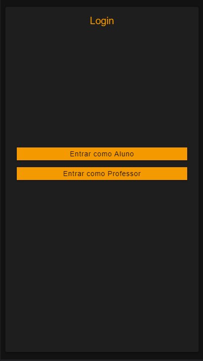
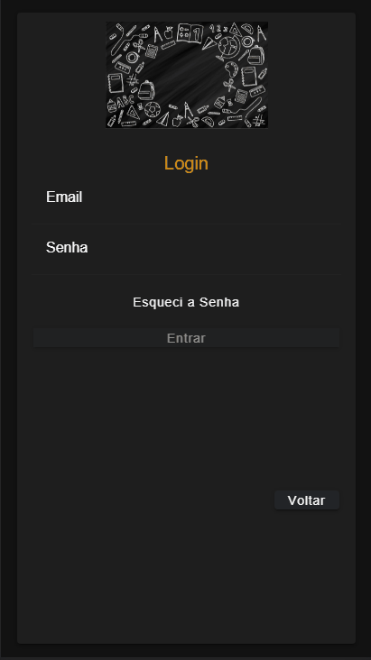
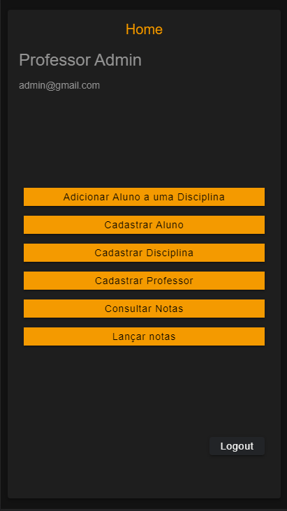
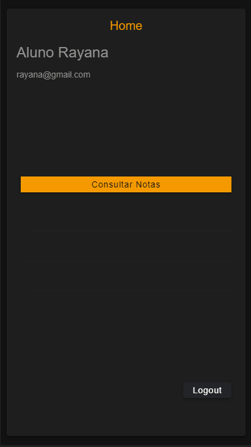

# Sistema Escola 

    <a href="#sobre">Sobre</a> -
    <a href="#requisitos">Requisitos</a> -
    <a href="#tecnologias">Tecnologias</a> -
    <a href="#features">Features</a> -
    <a href="#autor">Autor</a>

# Sobre

Esse projeto permite ao usuário cadastrar professores, alunos, notas e disciplinas.
 

Apenas professores tem autorização para lançar notas, criar disciplinas e cadastrar alunos, cadastrar novos professores.

Alunos tem apenas permissão para consultar suas notas

Também é possível recuperar uma senha esquecida.

# Requisitos
Instalar na máquina o [Git](https://git-scm.com/), o [nodeJs](https://nodejs.org/en/) e o [Ionic](https://ionicframework.com/docs/intro/cli).

Além disso é bom ter um editor para trabalhar com o código como [VSCode](https://code.visualstudio.com/download).

Também é bom ter um [backend](https://github.com/luizfelipe079/Sistema-Escola.git).

# Tecnologias
Foram usadas as seguintes tecnologias no projeto:

-[TypeScript](https://www.typescriptlang.org/)

-[Ionic](https://ionicframework.com/docs/intro/cli)

-[Node.js](https://nodejs.org/en/)

# Features
<h1 align="center">
    
</h1>

<h1 align="center">
    
</h1>

<h1 align="center">
    
</h1>

<h1 align="center">
    
</h1>

# Autor 
Made by Luiz Felipe Kaercher de Oliveira - [Linkedin](https://www.linkedin.com/in/luiz-felipe-kaercher-de-oliveira-142505142/)
